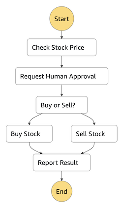

# Step Function (Orchestrate Lambda functions) in Temporal

This example demonstrates how to implement the AWS Step Functions sample [Orchestrate Lambda functions](https://docs.aws.amazon.com/step-functions/latest/dg/sample-lambda-orchestration.html) as a Temporal workflow using the Temporal Go SDK.

Note that the original AWS sample *does not* wait for an actual human to approve the human approval step. This workflow does. To approve/reject the request, the workflow expects a signal named `approve` that is a boolean (`true` to approve, `false` to reject).



This sample uses API keys for Temporal Cloud namespace authentication.

To run the worker;
```sh
go run ./worker \
-namespace <namespace>.<account> \
-grpcEndpoint <region>.<cloud>.api.temporal.io:7233 \
-apikey <apikey>
```

To run the workflow;
```sh
go run ./starter \
-namespace <namespace>.<account> \
-grpcEndpoint <region>.<cloud>.api.temporal.io:7233 \
-apikey <apikey>
```